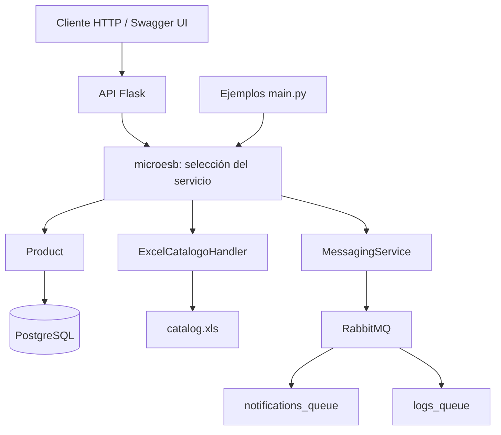

# Integración de catálogo con Python, PostgreSQL y RabbitMQ

Prototipo académico de arquitectura orientada a servicios (SOA) que ofrece una interfaz HTTP para consultar productos en Excel, gestionar productos en PostgreSQL y publicar mensajes en RabbitMQ mediante `microesb`.

El proyecto explora cómo acceder a fuentes y servicios distintos desde una interfaz común, separando la recepción de solicitudes, el enrutamiento y la lógica de cada servicio.

**Estado:** prototipo con funcionalidades implementadas y ajustes de instalación pendientes. La consulta directa del catálogo Excel fue verificada; la ejecución completa del ESB, la API, PostgreSQL y RabbitMQ está pendiente de validación en un entorno integrado.

## Funcionalidades

- Crear, consultar por ID, actualizar parcialmente y eliminar productos en PostgreSQL.
- Listar productos del catálogo Excel, consultar por ID y buscar por nombre.
- Publicar notificaciones de compra y eventos de log en colas de RabbitMQ.
- Recibir solicitudes JSON mediante `POST /executeService`.
- Ofrecer una interfaz Swagger UI en `/apidocs` con la especificación de `static/openapi.yaml`.
- Ejecutar ejemplos de llamadas a servicios desde `main.py`.

Los servicios se invocan de forma individual. No se implementa una sincronización automática de Excel hacia PostgreSQL, ni un flujo completo de compra que combine base de datos y mensajería. Publicar una notificación en una cola tampoco implica enviar un correo: este repositorio no incluye ese consumidor.

## Arquitectura



Los handlers y sus servicios Python se ejecutan dentro del proceso de la aplicación principal. PostgreSQL y RabbitMQ se ejecutan como servicios externos mediante Docker Compose.

### Flujo de una solicitud

1. El cliente envía un JSON a `/executeService` con `SYSServiceID` y los datos de la operación.
2. La API selecciona la configuración correspondiente al identificador del servicio.
3. `microesb` utiliza los mapeos para invocar el handler y el método indicado en `SYSServiceMethod`.
4. El handler consulta Excel, opera sobre PostgreSQL o publica un mensaje en RabbitMQ.
5. La API recupera `last_service_result` del handler y devuelve el resultado en JSON.

## Tecnologías

| Tecnología | Uso en el proyecto |
|---|---|
| Python | Implementación de la API, handlers y servicios |
| Flask y Flask-CORS | API HTTP y configuración de CORS |
| microesb | Mapeo e invocación de servicios |
| PostgreSQL y psycopg2 | Persistencia y operaciones sobre productos |
| RabbitMQ y AMQPStorm | Publicación de mensajes |
| pandas, xlrd y openpyxl | Lectura de archivos Excel |
| Docker Compose | Arranque de PostgreSQL y RabbitMQ |
| OpenAPI y Flask-Swagger-UI | Documentación interactiva de la API |

## Organización del repositorio

| Ruta | Responsabilidad |
|---|---|
| `app.py` | API principal, selección del servicio y Swagger UI |
| `main.py` | Secuencia de ejemplos de invocación al ESB |
| `esbconfig.py` | Referencias a las clases de los handlers |
| `microesb_config/` | Mapeos, propiedades y ejemplos de solicitudes |
| `services/db_service/` | Handler de productos y acceso a PostgreSQL |
| `services/messaging_service/` | Handler de mensajería y publicación en RabbitMQ |
| `services/xsl_service/` | Handler y lectura del catálogo Excel |
| `services/db_config.py` | Configuración de PostgreSQL |
| `services/rabbitmq_config.py` | Configuración de RabbitMQ y nombres de colas |
| `data/catalog.xls` | Catálogo de ejemplo |
| `init.sql` | Tabla `productos` y registros iniciales |
| `docker-compose.yml` | Servicios de base de datos y mensajería |
| `static/openapi.yaml` | Especificación de la API |
| `serviceXSL/` | Aplicación alternativa de conversión Excel a JSON |

**Aclaración de nombres:** las rutas `xsl_service` y `serviceXSL` contienen código para archivos **XLS/XLSX**. No implementan transformaciones XSLT.

## Datos de ejemplo

### Catálogo Excel

El archivo `data/catalog.xls` contiene una hoja `Catalog` con 20 productos y las columnas:

| Columna | Contenido |
|---|---|
| `ProductID` | Identificador del producto |
| `ProductName` | Nombre |
| `Description` | Descripción |
| `Category` | Categoría |
| `Quantity` | Cantidad |
| `Price ($)` | Precio |

El handler configura expresamente la hoja `Catalog`. Si se instancia `CatalogoXLSService` directamente, también debe indicarse ese nombre, porque su valor predeterminado es `Productos`.

### PostgreSQL

`init.sql` crea la tabla `productos` con `id`, `nombre`, `descripcion`, `categoria` y `precio`, e inserta los productos `P001`, `P002` y `P003`.

Excel y PostgreSQL son fuentes independientes. Sus esquemas e identificadores no se homologan automáticamente.

## Preparación y ejecución local

> La instalación todavía requiere resolver la procedencia de `microesb`. Los pasos siguientes documentan la preparación y el arranque previsto; no constituyen una validación completa de despliegue.

### 1. Preparar Python

Utilizar Python 3.11 o superior como entorno objetivo para las dependencias declaradas. Desde la raíz del proyecto, en PowerShell:

```powershell
python -m venv .venv
.\.venv\Scripts\Activate.ps1
```

### 2. Resolver las dependencias pendientes

Antes de ejecutar `pip install -r requirements.txt`:

- Sustituir la referencia local de `microesb @ file:///.../python-micro-esb` por una fuente instalable y verificable de la misma biblioteca. Esa copia no está incluida en el repositorio.
- Incorporar `Flask`, `Flask-CORS` y `flask-swagger-ui`, importados por `app.py` pero ausentes del archivo principal de dependencias.
- Revisar la declaración simultánea de `psycopg2` y `psycopg2-binary`; para una instalación local conviene elegir un solo paquete proveedor de `psycopg2`.

El archivo `serviceXSL/requirements.txt` declara `microesb==1.0`, pero no se ha comprobado que sea equivalente a la copia local utilizada por la aplicación principal.

Una vez corregido y verificado el archivo de dependencias:

```powershell
python -m pip install -r requirements.txt
```

### 3. Iniciar la infraestructura

Con Docker y Docker Compose disponibles:

```powershell
docker compose up -d
docker compose ps
docker compose logs db rabbitmq
```

Esperar a que ambos servicios acepten conexiones antes de iniciar la API.

| Servicio | Dirección local | Configuración de demostración |
|---|---|---|
| PostgreSQL | `localhost:5432` | Base: `esb_catalogo_db`; usuario: `esb_user`; contraseña: `esb_password` |
| RabbitMQ AMQP | `localhost:5672` | Usuario: `user`; contraseña: `password` |
| Administración RabbitMQ | [localhost:15672](http://localhost:15672) | Mismas credenciales de RabbitMQ |

Estos valores son los incluidos para desarrollo local. `services/db_config.py` y `services/rabbitmq_config.py` deben coincidir con la configuración de Compose.

PostgreSQL utiliza el volumen `db_data`. El script `init.sql` se ejecuta al inicializar un directorio de datos vacío; reiniciar un contenedor con un volumen existente no vuelve a aplicar automáticamente ese script.

### 4. Iniciar la API principal

Desde la raíz del proyecto, con el entorno virtual activo:

```powershell
python app.py
```

- Endpoint: `http://localhost:5000/executeService`
- Swagger UI: [localhost:5000/apidocs](http://localhost:5000/apidocs)
- Especificación: [localhost:5000/static/openapi.yaml](http://localhost:5000/static/openapi.yaml)

La aplicación utiliza el servidor de desarrollo de Flask con `debug=True`. Compose inicia únicamente PostgreSQL y RabbitMQ; no inicia la API.

### 5. Ejecutar los ejemplos de consola

Tras resolver los pendientes de configuración:

```powershell
python main.py
```

El script realiza operaciones CRUD sobre `P005`, publica mensajes y consulta el catálogo. Modifica los datos de demostración y no es una suite de pruebas automatizadas con aserciones.

## Operaciones del endpoint principal

Todas las operaciones utilizan `POST /executeService` con `Content-Type: application/json`.

| `SYSServiceID` | Handler | `SYSServiceMethod` |
|---|---|---|
| `getProductById` | `Product` | `get_by_id` |
| `createProduct` | `Product` | `create` |
| `updateProductById` | `Product` | `update` |
| `deleteProductById` | `Product` | `delete` |
| `sendPurchaseNotification` | `MessagingService` | `send_purchase_notification` |
| `registerLogEvent` | `MessagingService` | `register_log_event` |
| `getById` | `ExcelCatalogoHandler` | `get_by_id` |
| `listAll` | `ExcelCatalogoHandler` | `list_all_products` |
| `searchByName` | `ExcelCatalogoHandler` | `search_products_by_name` |

Los métodos de listado y búsqueda de Excel reflejan los nombres implementados en el handler. Hay que alinear sus nombres en `service_properties.py` antes de validar su invocación a través del ESB.

### Consultar un producto en PostgreSQL

```json
{
  "SYSServiceID": "getProductById",
  "data": [
    {
      "Product": {
        "SYSServiceMethod": "get_by_id",
        "id": "P001"
      }
    }
  ]
}
```

### Consultar un producto en Excel

Ejemplo para PowerShell, con la API en ejecución:

```powershell
$body = @{
    SYSServiceID = 'getById'
    data = @(
        @{
            ExcelCatalogoHandler = @{
                SYSServiceMethod = 'get_by_id'
                product_id = 'EL001'
            }
        }
    )
} | ConvertTo-Json -Depth 6

Invoke-RestMethod -Uri 'http://localhost:5000/executeService' -Method Post -ContentType 'application/json' -Body $body
```

### Publicar una notificación

```json
{
  "SYSServiceID": "sendPurchaseNotification",
  "data": [
    {
      "MessagingService": {
        "SYSServiceMethod": "send_purchase_notification",
        "compra_data": {
          "order_id": "ORD-DEMO-001",
          "product_id": "P001",
          "quantity": 1
        }
      }
    }
  ]
}
```

La operación publica el contenido en `notifications_queue`. Los eventos de log se publican en `logs_queue`. El código declara colas durables y marca los mensajes como persistentes; el Compose actual no configura un volumen de datos para RabbitMQ.

## Aplicación alternativa: serviceXSL

La carpeta `serviceXSL/` contiene otra aplicación Flask con rutas `/products`, `/catalog` y `/convert-xls-to-json`, configurada para el puerto 5400. Su conversor lee las hojas de un archivo Excel y genera JSON.

Esta aplicación no forma parte del recorrido de la API principal ni está incluida como servicio en Compose. Requiere revisar el acceso a `data/catalog.xls`, configurar `DATABASE_URL` y verificar sus dependencias antes de ejecutarla. Su Dockerfile y su archivo de dependencias corresponden a ese componente, no a un despliegue completo del proyecto.

## Verificaciones realizadas

Sobre la copia revisada se comprobó:

- Sintaxis válida en los 20 archivos Python, sin ejecutar sus imports.
- Lectura directa del catálogo mediante `CatalogoXLSService`, utilizando la hoja `Catalog`.
- Listado de 20 productos.
- Consulta satisfactoria del producto `EL001`.
- Búsqueda de `Cable` con dos coincidencias.

Estas verificaciones no prueban la API HTTP ni su integración con `microesb`, PostgreSQL o RabbitMQ. No se incluyen capturas ni métricas de ejecución integral todavía.

## Pendientes conocidos

- Resolver la fuente reproducible de `microesb` y completar las dependencias de la API.
- Alinear `list_all` y `search_by_name`, declarados en `service_properties.py`, con `list_all_products` y `search_products_by_name`, implementados en el handler.
- Corregir `sendPurchaseNotificacion` en el ejemplo de `service_call_metadata.py` para que coincida con `sendPurchaseNotification`, aceptado por la API HTTP.
- Revisar el registro duplicado de `/static/<path:filename>`: Flask tiene su ruta estática y el código registra otra que apunta a la raíz. Verificar la carga de `static/openapi.yaml` y unificar el comportamiento.
- Normalizar códigos HTTP: actualmente una operación puede devolver HTTP 200 con `status: error` en el cuerpo.
- Mejorar la validación de solicitudes y el manejo de valores vacíos al convertir Excel a JSON.
- Incorporar pruebas de integración y evidencias del recorrido completo.
- Documentar integrantes, contribuciones y procedencia de las dependencias externas antes de publicar.

## Capacidades técnicas representadas

El proyecto permite explicar separación de responsabilidades, construcción de APIs, configuración de servicios, consultas SQL, lectura de datos tabulares y publicación de eventos.

Su enfoque principal es **desarrollo backend e integración de servicios**. También aporta fundamentos de ingeniería de datos mediante acceso a fuentes heterogéneas y conversión de formatos. Una posible ampliación sería implementar un flujo de extracción, validación, transformación y carga del catálogo Excel hacia PostgreSQL, con registro de resultados y manejo de errores.
